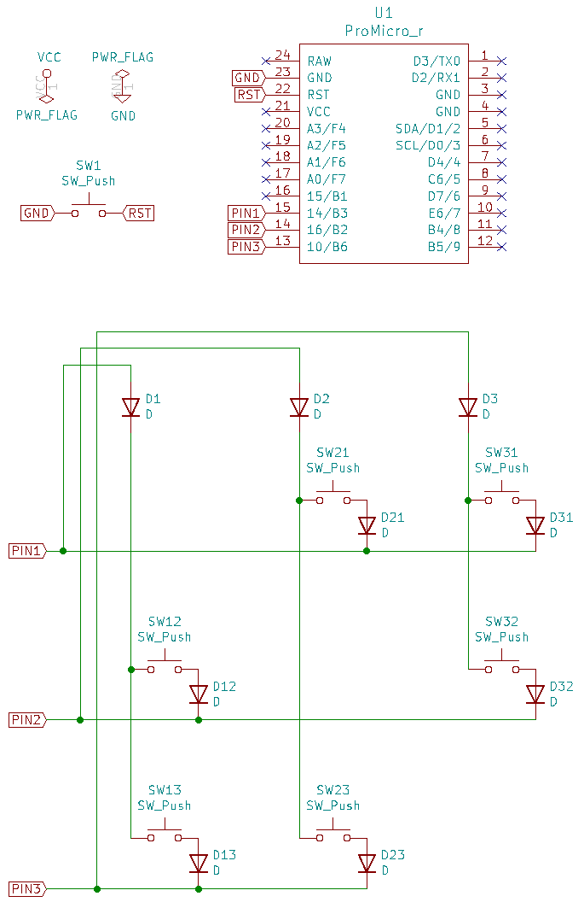

# 総当たりマトリクス / Round Robin Matrix

## 総当たりマトリクスとは

IKeJI氏のブログ記事、[キーボードのマトリクス方式の分類](https://blog.ikejima.org/make/keyboard/2019/12/14/keyboard-circuit.html)で *2乗マトリクス* として取り上げられているマトリクス方式のことです。  
全てのピンの間にキーを接続するマトリクスで、Nピン使用した場合に、N(N-1)のキーを接続できます。

特徴は、少ないピン数で多数のキーを扱えることです。

全てのピン同士を接続することから、総当たり戦のような接続をイメージしやすいよう、 *総当たりマトリクス* という呼称にしました。

## 回路設計

あるピンからの信号が押下されたスイッチを通り、別のピンで検知されるようにします。  
信号が自分自身に戻ってこないこと、列から行へ向かうことに気をつけます。

## ファームウェア整備

### rules.mk
カスタムマトリクスの設定と、総当たりマトリクス方式でのスキャン方法を記述したファイルを読み込む指定を追加します。  
matrix_rr.cファイルをrules.mkと同じフォルダへ配置します。  
matrix_rr.cはquantum/matrix.cを改変して作成します。[ここ](./assets/matrix_rr.c)にサンプルを用意しました。

    CUSTOM_MATRIX = yes
    SRC += matrix_rr.c

## config.h
使用するピンの数（ROW、COLともに同数）と、ピン番号（ROW、COLともに同じ）を指定します。

    #define MATRIX_ROWS 3
    #define MATRIX_COLS 3

    #define MATRIX_ROW_PINS { B3, B2, B6 }
    #define MATRIX_COL_PINS { B3, B2, B6 }

## keyboard.h
マトリクスレイアウトを次のように指定します。  
ここでは、K（COL番号）（ROW番号）のように記述しています。  
例：  
K12　1列目2行目のキー。

    #define LAYOUT( \
        K12, K21, K31, \
        K13, K23, K32  \
    ) \
    { \
        { KC_NO,K21,  K31   }, \
        { K12,  KC_NO,K32   }, \
        { K13,  K23,  KC_NO } \
    }
