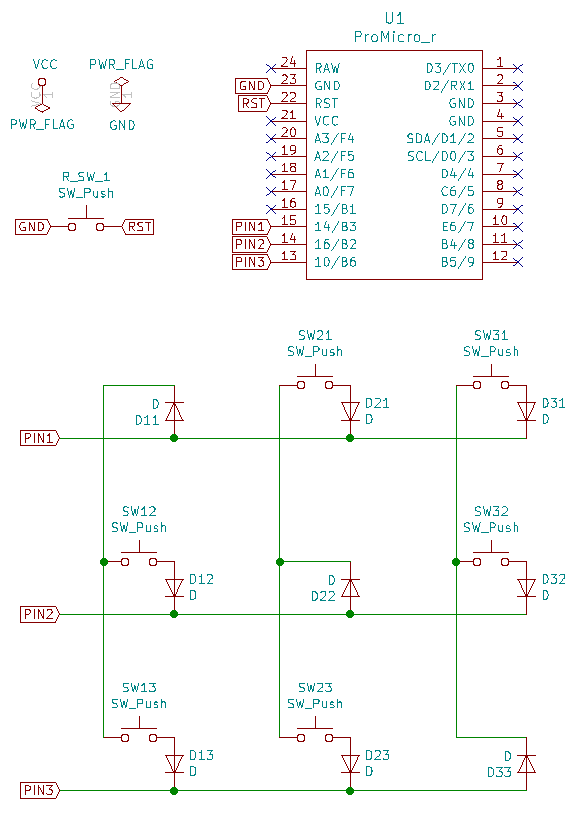

# 総当たりマトリクス / Round Robin Matrix

## 目次
<!-- @import "[TOC]" {cmd="toc" depthFrom=2 depthTo=3 orderedList=false} -->

<!-- code_chunk_output -->

- [目次](#目次)
- [総当たりマトリクスとは](#総当たりマトリクスとは)
  - [利点](#利点)
  - [欠点](#欠点)
- [回路設計](#回路設計)
- [ゴースト対策についての考察](#ゴースト対策についての考察)
- [QMKファームウェアの整備](#qmkファームウェアの整備)
  - [rules.mk](#rulesmk)
  - [keyboard config.h](#keyboard-configh)
  - [keyboard.h](#keyboardh)
- [総当たりマトリクスを採用しているキーボード](#総当たりマトリクスを採用しているキーボード)

<!-- /code_chunk_output -->

## 総当たりマトリクスとは

IKeJI氏のブログ記事、[キーボードのマトリクス方式の分類](https://blog.ikejima.org/make/keyboard/2019/12/14/keyboard-circuit.html)で取り上げられている`2乗マトリクス`に、ゴースト回避方法を追加したマトリクス方式です。  
回路図が総当たり戦のリーグ表ような形になるため、`総当たりマトリクス`という呼称にしました。

全てのGPIOピンの間にキーを接続するマトリクス方式で、`N個のピンでN(N-1)個のキー`を接続できます。  

### 利点

- 少ないピン数で、多くのキーを接続できる

- 他の方式に比べ、使用するピン数を少なくできる  
  マトリクス方式における、接続できるキー数の比較
    | 使用ピン数 | 総当たり | Duplex | COL2ROW |
    | :-: | :-: | :-: | :-: |
    | N | N(N-1) | N^2/2 | N^2/4 |
    | 4 | 12 | 8 | 4 |
    | 8 | 56 | 32 | 16 |
    | 10 | 90 | 50 | 25 |

- QMKファームウェアの整備が簡単  
  カスタムマトリクス（matrix.c）を用意しなくても、標準のCOL2ROWのマトリクス処理で動作可能。  

### 欠点

- 使用できる条件が限られる  
マイコンのGPIOピンの仕様と、ダイオードの電圧降下特性によって動作条件が決まるため、動作する部品の組み合わせが限られます。
現在のところ、Pro Microを含むATmega32u4と、1N4148ダイオードの組み合わせで動作することが確認できています。

- ダイオードの使用数がわずかに増える

- 回路設計，基板配線の手間が少し増える

- RemapやVIAで使用できるレイヤー数が減る場合がある  
  QMKファームウェアで使用するピン数を行と列へ重複して定義するため、EEPROMの使用サイズが多くなります。  
  その結果、RemapやVIAで保存できるレイヤー数が減る場合があります。  
  例：70キーのキーボードを作る場合の比較
    | 方式 | 使用ピン数 | EEPROM使用byte(\*) | EEPROM 1KBで<br>使用できるレイヤー数 | 備考 |
    | :-: | :-: | :-- | :-- | :-- |
    | 総当たり | 9 | 9 * 9 * 2 * レイヤー数<br>= 162 * レイヤー数 | 5 | |
    | Duplex | 12 | 6 * (6 * 2) * 2 * レイヤー数<br>= 144 * レイヤー数 | 6 | DuplexのためCOLSを2倍 |

  \*EEPROM使用byteは、`dynamic_keymap.c`により`MATRIX_ROWS * MATRIX_COLS * 2 * レイヤー数`で計算されます。


## 回路設計

2行×3列で6キーのマクロパッドの作成例です。

1. 使用するピンの数を決めます。
    この例では6キーなので、3個のピンを使用して、3(3-1)=6キーを接続します。

    ```aside
    次のような計算で、ピンの使用数を3個と決めます。
    2ピン：2(2-1)=2キー → 足りない
    3ピン：3(3-1)=6キー → 足りる
    4ピン：4(4-1)=12キー → 多すぎ
    ```

1. ピンとピンの間にスイッチを配置します。  
  同じピンの間には配置しません。

    | | Pin1 | Pin2 | Pin3|
    |:-:|:-:|:-:|:-:|
    |Pin1| - | SW21 | SW31 |
    |Pin2| SW12 | - | SW32 |
    |Pin3| SW13 | SW23 | - |  

1. ピンから他のピンへ向かう箇所にダイオードを挿入します。

回路図は次のようになります。



## ゴースト対策についての考察

ゴーストの発生が懸念される条件の例として、上記の2行×3列のマクロパッドの回路で、

```text
SW12とSW23のスイッチを同時に押した状態で、PIN3においてPIN1の状態を判定
```

する場合を考えます。

この場合、

`PIN1 --> D11 --> SW12 --> D12 --> D22 --> SW23 --> D23 --> PIN3`

の経路で`PIN1`の状態が`PIN3`で判定されます。

もし、この判定結果が`Lo`になると、押していないスイッチ`SW13`が押されていると認識され、ゴーストが発生します。

ATmega32u4が信号を`Lo`として判定するための、`Highレベル入力電圧`の最小値である`VIHmin`は、  
データシート（ATmega16U4/32U4 - Complete Datasheet）の383ページ、表29.2 DC Characteristicsより、  

```text
0.2 VCC + 0.9
```

であり、Vccが5Vの場合は、

```text
VIHmin = 0.2 * 5 + 0.9 = 1.9V
```

と計算されます。

自作キーボードでよく使用されているダイオード1N4148の電圧降下は、データシートより、

```text
0.6Vから1V程度
```

です。

さて、条件として挙げた経路では4個のダイオードを通過しており、ダイオード1個あたりの電圧降下を少なめの0.6Vと見積もった場合でも、合計2.4Vの電圧降下が発生します。  
この電圧降下によって、1.9Vと計算されたATmega32u4の`VIHmin`を超えるため、`PIN1`は`Hi`と判定され、ゴーストは発生しません。

データシート等のリンク

- [ATmega32U4 - 8-bit AVR Microcontrollers](https://www.microchip.com/wwwproducts/en/ATmega32u4)  
- [汎用小信号高速スイッチング・ダイオード　１Ｎ４１４８　１００](http://akizukidenshi.com/catalog/g/gI-00941/)  
- [高速スイッチング・ダイオード１Ｎ４１４８Ｗ](http://akizukidenshi.com/catalog/g/gI-07084/)

## QMKファームウェアの整備

ここでは、より簡単な実装方法として、一般的なマトリクスと同じ`COL2ROW`でマトリクススキャンする整備方法を紹介します。

もちろん、カスタムマトリクス（matrix.c）を用意して、総当たりマトリクス専用のマトリクススキャンを実装することも可能です。

### rules.mk

  変更なし。  
  カスタムマトリクスは不要です。

### keyboard config.h

総当たりマトリクスに関して、次のように指定します。

- ピン数とピン番号の指定  
ROW, COLともに同じピン数、同じピン番号を指定します。

- ダイオードの方向  
一般的なマトリクスと同じ`COL2ROW`を指定します。  

    ```aside
    ROWとCOLに同じピン番号を指定しているので、
    COL2ROWを指定するだけで、すべてのピン同士でスイッチ押下のスキャンがおこなわれます。
    ```

- ブートローダへ入るためのキー指定
Bootmagicを使用する場合は、必要に応じて指定します。  
**VIAを使用する場合（rules.mkで`VIA_ENABLE = yes`を指定した場合）はBootmagicが自動で有効になるため、指定し忘れに注意してください。**

    ```aside
    何も指定しない場合は、マトリクスの左上(0,0)のキーがブートローダへ入るために使用されます。（QMKのデフォルト）  
    上記の回路で(0,0)に該当するのは、[Pin1]-[Pin1]であり、常に押された状態と判定されます。  
    その結果、ずっとブートローダに入りっぱなしになってしまい、キーボードが起動しなくなります。
    ```

    ```aside
    回路図の設計を工夫してハードウェア的に回避したり、
    keyboard.hを工夫してソフトウェア的に回避することもできます。
    ```

変更点をまとめると、次のようなコードになります。

```c
/* ピン数 */
#define MATRIX_ROWS 3
#define MATRIX_COLS 3

/* ピン番号 */
#define MATRIX_ROW_PINS { B3, B2, B6 }
#define MATRIX_COL_PINS { B3, B2, B6 }

/* ダイオードの方向 */
#define DIODE_DIRECTION COL2ROW

/* ブートローダへ入るためのキーを、マトリクスで0行2列の位置（＝左下）に指定する例 */
#define BOOTMAGIC_LITE_ROW 0
#define BOOTMAGIC_LITE_COLUMN 2
```

### keyboard.h

回路上のマトリクスと物理的なキー配置を対応づけします。

- 物理的なキー配置（上半分）  
回路上のマトリクスで`KC_NO`となっている部分を詰めて、2行×3列に配置します。

- 回路上のマトリクス（下半分）  
3行×3列の回路上のマトリクスのうち、スイッチを配置しない箇所へ`KC_NO`を記入します。

```c
#define LAYOUT( \
    K12, K21, K31, \
    K13, K23, K32  \
) \
{ \
    { KC_NO, K21,   K31   }, \
    { K12,   KC_NO, K32   }, \
    { K13,   K23,   KC_NO } \
}
```


## 総当たりマトリクスを採用しているキーボード

他にもございましたら、教えてください。

- [AtreusRR](https://github.com/jpskenn/AtreusRR)

- [Colice](https://github.com/jpskenn/Colice)

- [Jones](https://github.com/jpskenn/Jones)
